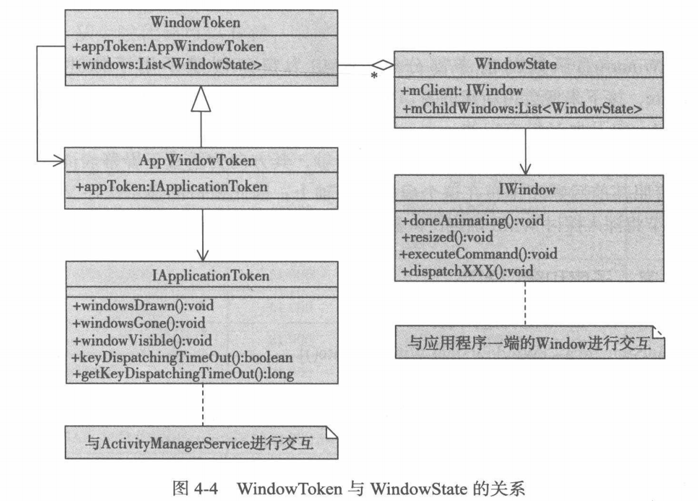
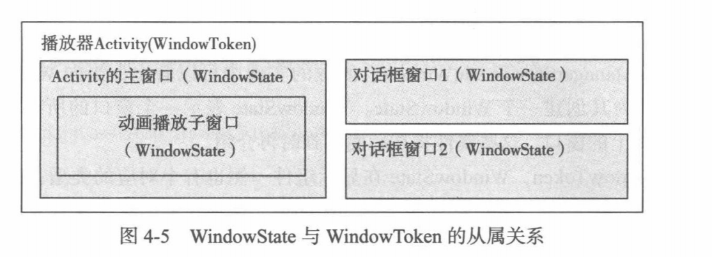
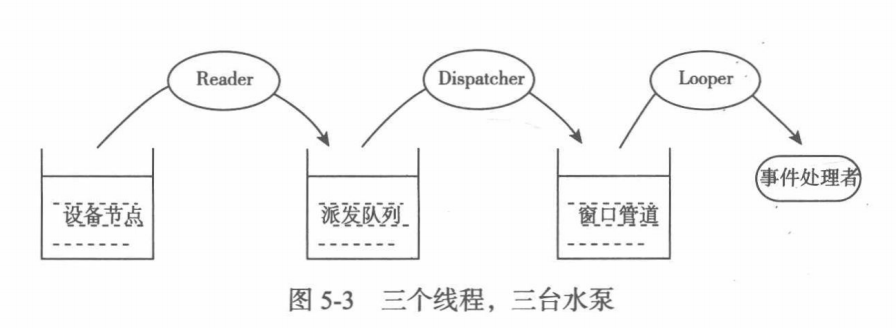
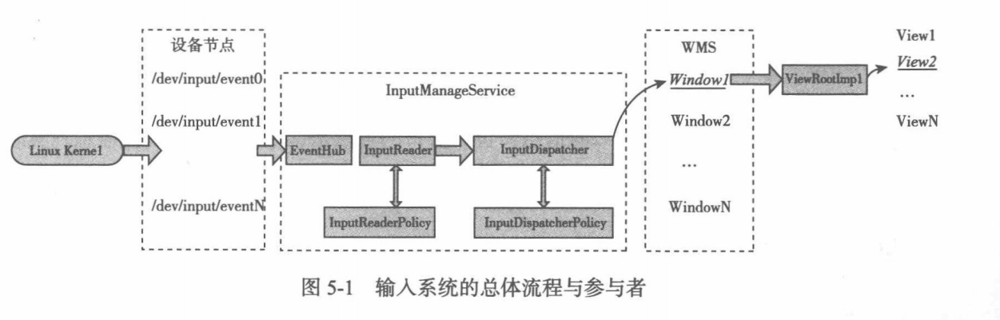
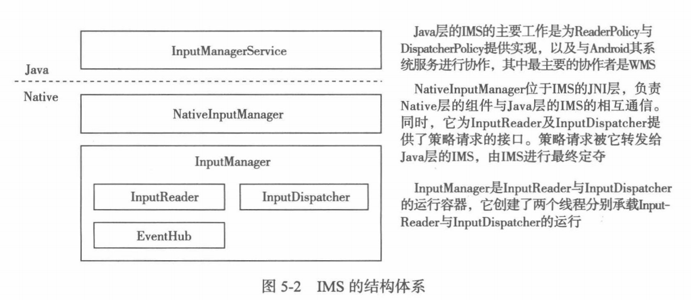
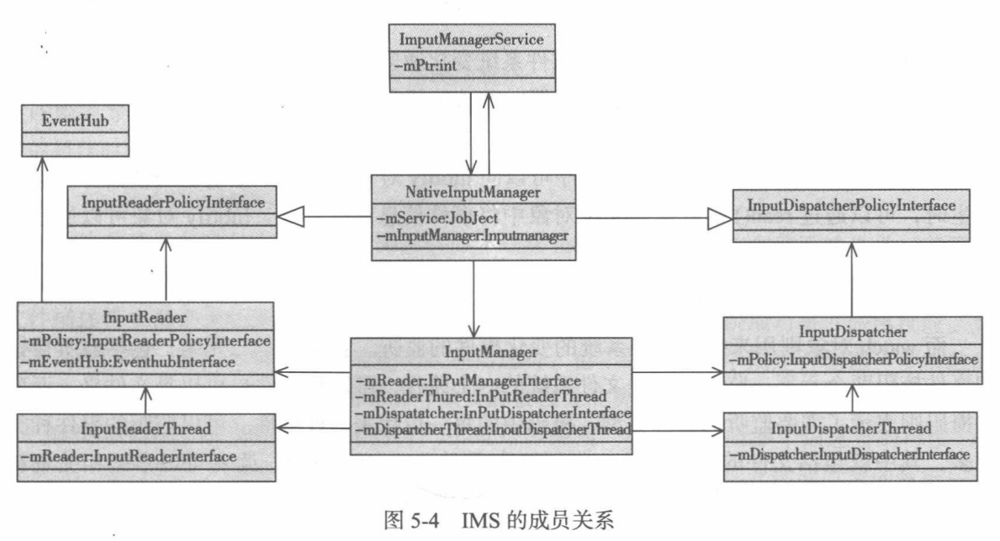

[TOC]

# ActivityManagerService
>参考
[Android6.0 AMS启动Activity（四） AMS内部一些成员变量](http://blog.csdn.net/kc58236582/article/details/52484432)
Android M应用启动流程分析http://www.jianshu.com/p/7ef2e9e80de4

## Activity 启动关键流程
```
//com.android.server.am.ActivityManagerService
public final WaitResult startActivityAndWait(IApplicationThread caller,...){
    //所有的 ActivityStacks 都是通过此变量进行操作
    //最终会调用到startActivityLocked
    mStackSupervisor.startActivityMayWait(caller, -1, callin...);
}

//ActivityStackSupervisor
final int startActivityLocked(IApplicationThread caller,..){
    //为当前Activity 创建 ActivityRecord 
    ActivityRecord r = new ActivityRecord(mService, c...);
    err = startActivityUncheckedLocked(r, sourceRe...)
}
final int startActivityUncheckedLocked(final ActivityRecord r, Activity...){
    ActivityStack targetStack;
    //新任务
    if (r.resultTo == null && inTask == null && !addingToTask
            && (launchFlags & Intent.FLAG_ACTIVITY_NEW_TASK) != 0) {
        newTask = true;
        //创建应用 ActivityStack
        targetStack = computeStackFocus(r, newTask);
        targetStack.moveToFront("startingNewTask");
        if (reuseTask == null) {
            //设置ActivityRecord的TaskRecord
            //createTaskRecord,创建一个新的TaskRecord并加入到ActivityStack
            //此处是直接使用了默认显示屏
            r.setTask(targetStack.createTaskRecord(getNextTaskId(),...);
        }
    }
    targetStack.mLastPausedActivity = null;
    targetStack.startActivityLocked(r, newTask, ...);
}

final void startActivityLocked(ActivityRecord r, boole...){
    task = r.task;
    //将rTask添加到mTaskHistory
    insertTaskAtTop(rTask, r);
    task.addActivityToTop(r);
}
//com.android.server.am.ActivityStackSupervisor#realStartActivityLocked
final boolean realStartActivityLocked(ActivityRecord r,..){
    app.thread.scheduleLaunchActivity(new Intent(r.intent), r.appToken,...);
}
//android.app.ActivityThread.ApplicationThread#scheduleLaunchActivity
public final void scheduleLaunchActivity(Intent intent, IBinder token, int ide..){
}
private void handleLaunchActivity(ActivityClientRecord r, ..){
    Activity a = performLaunchActivity(r, customIntent);
    handleResumeActivity(r.token, false, r.isForward..);
}
private Activity performLaunchActivity(ActivityClientRecord r,
    //创建上下文(display)
    Context appContext = createBaseContextForActivity(r, activity);
    //创建 WindowManager, 用于 handleResumeActivity 中 wm.addView(decor, l);
     activity.attach(appContext, this, getIns...);
}
final void handleResumeActivity(IBinder token,...){
    ActivityClientRecord r = performResumeActivity(token, clearHide);
        //WindowManager
        wm.addView(decor, l);
}
```

-----------------------------------
备忘
- ApplicationThreadNative 实现IApplicationTread接口,从该接口定义的函数可知,AMS通过它可以和应用程序进行交互.
- ActivityThread通过成员变量mAppThread指向它内部类ApplicationThread, 而ApplicationThread从ApplicationThreadNative派生.
- IApplicationThread 仅仅是AMS和另外一个进程的交互接口.
- ProcessRecord 保存了进程相关信息,如IApplicationThread

--------------------------------------------


## 任务栈相关类
- ActivityDisplay
 - ActivityStack
   - TaskRecord

### ActivityDisplay
代表一个显示屏
```
int mDisplayId; 显示屏ID,由初始化时分配
ArrayList<ActivityStack> mStacks; 显示屏的所有ActivityStack.
```

### ActivityContainer
对应一个 ActivityStack,其 ActivityStack 变是在此类中创建.
```
final int mStackId; //任务栈ID
final ActivityStack mStack; //当前new ActivityStack(this,...)
ActivityDisplay mActivityDisplay; //对应的显示屏
ActivityStack createStackOnDisplay(int stackId, int displayId) {
    //1. 根据显示屏ID查找ActivityDisplay
    ActivityDisplay activityDisplay = mActivityDisplays.get(displayId);
    //2. 创建ActivityContainer,在其中会创建mStack,即ActivityStack
    ActivityContainer activityContainer = new ActivityContainer(stackId);
    //3. mActivityContainers保存ActivityContainer
    mActivityContainers.put(stackId, activityContainer);
    //4.将activityContainer内部初始化工作
    activityContainer.attachToDisplayLocked(activityDisplay);
    return activityContainer.mStack;
}
```
### ActivityStack
```
ActivityContainer mActivityContainer;
ArrayList<TaskRecord> mTaskHistory; //所有TaskRecord
ArrayList<ActivityStack> mStacks; //对应ActivityDisplay.mStacks
int mDisplayId; //对应的显示屏ID
int mStackId; //任务栈ID
```
### TaskRecord
代表一个应用程序的 Activity 顺序栈
```
ActivityStack stack; //当前所处的应用任务栈
//当前任务栈中的Activity
ArrayList<ActivityRecord> mActivities
```

### ActivityRecord
表示一个 Activity
```
TaskRecord task; //当前Activity所处的应用任务栈
```

## ActivityStackSupervisor
应用的所有操作都在此类中进行.


## 应用缩略图截图(Recents)
用于最近任务中
```
public final Bitmap screenshotActivities(ActivityRecord who) {
}
```

# ActivityThread
## 将窗口到WMS
```
void android.app.ActivityThread#handleResumeActivity(IBinder token,...){
    if (a.mVisibleFromClient) {
        a.mWindowAdded = true;
        wm.addView(decor, l);
    }
}
//Activity#mWindowManager
//android.view.Window
public void setWindowManager(WindowManager wm, IBinder..){
    mWindowManager = ((WindowManagerImpl)wm).createLocalWindowManager(this);
}
```

## ViewRootImpl
```
android.view.ViewRootImpl#performTraversals(){
    relayoutResult = relayoutWindow(params, viewVisibility, insetsPending);
    performDraw();
}
```

## 分屏模式下焦点切换
```
//android.view.InputEventReceiver#dispatchInputEvent
private void dispatchInputEvent(int seq, InputEvent event) {
    mSeqMap.put(event.getSequenceNumber(), seq);
    onInputEvent(event);
}

//com.android.server.wm.StackTapPointerEventListener#onPointerEvent
public void onPointerEvent(MotionEvent motionEvent) {
    case MotionEvent.ACTION_UP:
    case MotionEvent.ACTION_POINTER_UP: {
        mService.mH.obtainMessage(H.TAP_OUTSIDE_STACK, x, y,
                mDisplayContent).sendToTarget();
}

//com.android.server.wm.WindowManagerService.H#handleMessage
public void handleMessage(Message msg) {
        case TAP_OUTSIDE_STACK: {
            stackId = ((DisplayContent)msg.obj).stackIdFromPoint(msg.arg1, msg.arg2);
            mActivityManager.setFocusedStack(stackId);   
        }
}
```

-----------------------


# WindowManagerService 窗口管理
>《深入理解Android 卷III》深入理解WindowManagerServicehttp://blog.csdn.net/innost/article/details/47660193
Android 4.4 双显示屏支持实现思路http://blog.csdn.net/ljp1205/article/details/53540739
Dialog创建到显示:http://blog.csdn.net/u011913612/article/details/51723510 
AndroidActivity启动的实现[AndroidActivity启动的实现](http://blog.csdn.net/u011365633/article/details/55001840)

窗口的根View`DecorView`
输入法相关:public boolean inputMethodClientHasFocus(IInputMethodClient client);


## 总体流程图
### WindowToken和WindowState关系

### WindowState和WindowToken的从属关系


重要成员变量
```
//策略
final WindowManagerPolicy mPolicy = new PhoneWindowManager();
//令牌
final HashMap<IBinder, WindowToken> mTokenMap = new HashMap<>();
//窗口
final HashMap<IBinder, WindowState> mWindowMap = new HashMap<>();


```
>其中4.2.2中:
- `uiHandler`对应`UiThread#getHandler`
- `wmHandler`对应`DisplayThread#getHandler`
`AppWindowToken`专门用于`Activity`保存Token

## 添加窗口流程:
```sequence
WindowManagerService->WindowManagerService:addWindowToken(IBinder token, int type)\n/addAppToken(..., IApplicationToken token,...)
WindowManagerService->WindowManagerService:addWindow(Session session, IWindow client, int seq,...)
```


```
public void addWindowToken(IBinder token, int type) {
    wtoken = new WindowToken(this, token, type, true);
    mTokenMap.put(token, wtoken);
}

public void addAppToken(...,IApplicationToken token,...) {
    atoken = new AppWindowToken(this, token, voiceInteraction);
    mTokenMap.put(token.asBinder(), atoken);
}

public int addWindow(Session session, IWindow client, ...) {
    WindowToken token = mTokenMap.get(attrs.token);
    if (token == null) {
        token = new WindowToken(this, attrs.token, -1, false);
        addToken = true;
    } 
    WindowState win = new WindowState(this, session, client, token,...);
    //////!!!!
    mTokenMap.put(attrs.token, token);
    win.attach();
    //////!!!
    mWindowMap.put(client.asBinder(), win);
}
```


mAppTokens 列表中AppWindowToken顺序和ActivityRecord顺序一致
>Task task = mTaskIdToTask.get(taskId);
task#mAppTokens

----------------
## 其他函数备忘
```
//获取当前显示屏的WindowState
WindowManagerService#getTokenWindowsOnDisplay
//添加WindState
addWindowToListInOrderLocked(){
    win.getWindowList().add(pos,win)
    win.mToken.windows.add(pos,win)
    win.mAppToken.allAppWindows.add(win);
}
handleDisplayAdded(msg.arg1)
主屏启动其他Activity,副屏被pause
void activityPausedLocked(IBinder token, boolean timeout)
//log hdmi拔出
176-309/? D/hwcomposer: ###hdmi plug out###
```

---------------


# 输入系统

参考:
>6.0 源码 http://blog.csdn.net/u011913612/article/details/53033356?locationNum=2&fps=1
从你触摸屏幕开始分析android触摸事件分发http://www.jianshu.com/p/8bd40df31d43

## 基础知识:INotify 与 Epoll
### INotify
文件监控,如新建,删除.
1. 创建 Inotify 对象
```
int fd = inotify_init();
```
2. 添加监听事件,如新建和删除事件
```
int wd = inotify_add_watch(fd, "dev/input", IN_CREATE | IN_DELETE);
```
3. 事件读取,当事件发生变化时.
```
struct inotify_event events_buf[BUFF_LEN];
size_t len =  read(fd, events_buf, BUFF_LEN);
```
### Epoll 介绍和使用
可一次等待监听多个描述符的读写状态
`epoll_wait(...)`等待事件的到来.
## 总体流程图
### 事件上报流程

### 输入系统的总体流程与参与者

### IMS结构体系

### IMS成员关系


## 创建 InputManagerService
```
//SystemServer.java
private void startOtherServices(){
    //step 1. 创建具体对象
    inputManager = new InputManagerService(context); 
    inputManager.setWindowManagerCallbacks(wm.getInputMonitor());
    //step 2. 启动工作线程
    inputManager.start();
}

```
### step 1 创建InputManagerService对象
对象创建过程:
- 创建InputManagerService
 - 创建NativeInputManager,其继承了InputReaderPolicyInterface等
   - 创建EventHub 
   - 创建InputManager(EventHub,...)
     - 创建InputDispatcher 事件分发
     - 创建InputReader(eventHub,..,InputDispatcher) 事件读取


```
 //SystemServer.java
 private void startOtherServices(){
     inputManager = new InputManagerService(context); 
 }
//InputManagerService.java
public InputManagerService(Context context) {
    mPtr = nativeInit(this, mContext,...);
}
//com_android_server_input_InputManagerService.cpp
static jlong nativeInit(JNIEnv* env,...) {
    NativeInputManager* im = new NativeInputManager(contextObj,...);
    return reinterpret_cast<jlong>(im);
}
NativeInputManager::NativeInputManager(jobject contextObj,
        jobject serviceObj, const sp<Looper>& looper) :
        mLooper(looper), mInteractive(true) {
    sp<EventHub> eventHub = new EventHub();
    mInputManager = new InputManager(eventHub, this, this);
}
InputManager::InputManager(eventHub, readerPolicy,dispatcherPolicy) {
    mDispatcher = new InputDispatcher(dispatcherPolicy);
    mReader = new InputReader(eventHub, readerPolicy, mDispatcher);
    initialize();
}
//创建读,分发线程.
void InputManager::initialize() {
    mReaderThread = new InputReaderThread(mReader);
    mDispatcherThread = new InputDispatcherThread(mDispatcher);
}
```

### step 2 启动线程
```
//SystemServer.java
private void startOtherServices(){
    inputManager.start();
}
//InputManagerService.java
public void start() {
    nativeStart(mPtr);
}
//com_android_server_input_InputManagerService.cpp
static void nativeStart(JNIEnv* env, jclass /* clazz */, jlong ptr) {
    NativeInputManager* im = reinterpret_cast<NativeInputManager*>(ptr);
    status_t result = im->getInputManager()->start();
}
status_t InputManager::start() {
    status_t result = mDispatcherThread->run("InputDispatcher", PRIORITY_URGENT_DISPLAY);
    result = mReaderThread->run("InputReader", PRIORITY_URGENT_DISPLAY);
}
```

---------------

## EventHub

### 创建 EventHub
INotify 可以监听事件的变化,可以通过read来进行读取事件,但是何时读取,则需要Epolll 来进行协助,Epoll 可监听事件的变化并返回:
```
//创建INotify对象,在此对象中进行事件的监听.
int mINotifyFd = inotify_init();
int mEpollFd = epoll_create(...);
//然后对INotify 对象进行监视,当INotify对象有事件到来时候,则可以调用INotify中的read来进行事件的读取
int result epoll_ctr(mEpollFd, EPOLL_CTL_ADD, mINotifyFd, ..)
//epoll等待事件到来
epoll_wait(...)
```
EventHub 构造函数
```
EventHub::EventHub(void) :
        mBuiltInKeyboardId(NO_BUILT_IN_KEYBOARD), mNextDeviceId(1), mControllerNumbers(),
        mOpeningDevices(0), mClosingDevices(0),
        mNeedToSendFinishedDeviceScan(false),
        mNeedToReopenDevices(false),
        mNeedToScanDevices(true),//其在第一次getEvents()会扫描设备
        mPendingEventCount(0), mPendingEventIndex(0), mPendingINotify(false) {

}
```


### EventHub 获取输入设备
在`InputManager::start()`启动之后,`mReaderThread`将会执行`threadLoop()`.
第一次执行`getEvents()`将扫描设备并添加到`mDevices`,将设备添加事件存到`buffer`上报给`InputReader`中
```
bool InputReaderThread::threadLoop() {
    mReader->loopOnce();
}

void InputReader::loopOnce(){
    mEventHub->getEvents(timeoutMillis, mEventBuffer, EVENT_BUFFER_SIZE);
}
size_t EventHub::getEvents(int timeoutMillis, RawEvent* buffer, size_t bufferSize) {
    //扫描设备
    scanDevicesLocked();
    //讲扫描的设备作为 DEVICE_ADDED事件上报
    while (mOpeningDevices != NULL) {
        Device* device = mOpeningDevices;
        event->type = DEVICE_ADDED;
        mNeedToSendFinishedDeviceScan = true;
    }
    //添加扫描完成FINISHED_DEVICE_SCAN事件
    if (mNeedToSendFinishedDeviceScan) {
        mNeedToSendFinishedDeviceScan = false;
        event->type = FINISHED_DEVICE_SCAN;
    }
}
void EventHub::scanDevicesLocked() {
    status_t res = scanDirLocked(DEVICE_PATH);
}
status_t EventHub::scanDirLocked(const char *dirname){
    while(..){
        openDeviceLocked(devname);
    }
}
status_t EventHub::openDeviceLocked(const char *devicePath) {
    int32_t deviceId = mNextDeviceId++;
    Device* device = new Device(fd, deviceId, String8(devicePath), identifier);
    //触摸屏设备
    device->classes |= INPUT_DEVICE_CLASS_TOUCH | INPUT_DEVICE_CLASS_TOUCH_MT;
    addDeviceLocked(device);
}
void EventHub::addDeviceLocked(Device* device) {
    mDevices.add(device->id, device);
    //新增设备加到mOpeningDevices中,用于DEVICE_ADDED事件上报
    device->next = mOpeningDevices;
    mOpeningDevices = device;
}

```


----

## InputReader
### 创建 InputReader
其中:
`policy`对应`NativeInputManager`对象
`listener`对应`InputDispatcher`
```
InputReader::InputReader(const sp<EventHubInterface>& eventHub,
        const sp<InputReaderPolicyInterface>& policy,
        const sp<InputListenerInterface>& listener) :
        mContext(this), mEventHub(eventHub), mPolicy(policy),...{
    mQueuedListener = new QueuedInputListener(listener);
}
```

### InputReader 处理 EventHub 上报的设备
```
void InputReader::loopOnce() {
    //第一次执行getEvents将会去扫描设备
    size_t count = mEventHub->getEvents(timeoutMillis, mEventBuffer, EVENT_BUFFER_SIZE);
    processEventsLocked(mEventBuffer, count);
    mQueuedListener->flush();
}

void InputReader::processEventsLocked(const RawEvent* rawEvents, size_t count) {
    //rawEvents数据:{DEVICE_ADDED,DEVICE_ADDED,..FINISHED_DEVICE_SCAN}
    for (const RawEvent* rawEvent = rawEvents; count;) {
        switch (rawEvent->type) {
        case EventHubInterface::DEVICE_ADDED:
            //添加设备事件
            addDeviceLocked(rawEvent->when, rawEvent->deviceId);
            break;
        case EventHubInterface::FINISHED_DEVICE_SCAN:
            //添加设备事件最后一个事件一定为FINISHED_DEVICE_SCAN
            handleConfigurationChangedLocked(rawEvent->when);
            break;
        }
    }
}

void InputReader::addDeviceLocked(nsecs_t when, int32_t deviceId) {
    ssize_t deviceIndex = mDevices.indexOfKey(deviceId);
    InputDevice* device = createDeviceLocked(deviceId, controllerNumber, identifier, classes);
    //配置设备的InputMapper
    device->configure(when, &mConfig, 0);
    //此mDevices和EventHub中的mDevices数据一一对应
    mDevices.add(deviceId, device);
}
//创建设备,并添加设备的相关InputMapper
InputDevice* InputReader::createDeviceLocked(int32_t deviceId,..., uint32_t classes) {
    InputDevice* device = new InputDevice(&mContext, deviceId,..., classes);
    //根据classes添加各种InputMapper
    // Touchscreens and touchpad devices.
    if (classes & INPUT_DEVICE_CLASS_TOUCH_MT) {
        device->addMapper(new MultiTouchInputMapper(device));
    } else if (classes & INPUT_DEVICE_CLASS_TOUCH) {
        device->addMapper(new SingleTouchInputMapper(device));
    }
    return device;
}


```

### 新设备配置 InputMapper
InputMapper 用于对原始数据的加工

```
void InputReader::addDeviceLocked(nsecs_t when, int32_t deviceId) {
    ssize_t deviceIndex = mDevices.indexOfKey(deviceId);
    InputDevice* device = createDeviceLocked(deviceId, controllerNumber, identifier, classes);
    //配置设备的InputMapper
    device->configure(when, &mConfig, 0);
}

void InputDevice::configure(nsecs_t when, const InputReaderConfiguration* config, uint32_t changes) {
    for (size_t i = 0; i < numMappers; i++) {
        InputMapper* mapper = mMappers[i];
        mapper->configure(when, config, changes);
    }
}
//以TouchInputMapper为例
void TouchInputMapper::configure(nsecs_t when,
        const InputReaderConfiguration* config, uint32_t changes) {
    InputMapper::configure(when, config, changes);
    mConfig = *config;
    configureSurface(when, &resetNeeded);
}

void TouchInputMapper::configureSurface(nsecs_t when, bool* outResetNeeded) {
    DisplayViewport newViewport;
    mConfig.getDisplayInfo(mParameters.associatedDisplayIsExternal, &newViewport)
    mViewport = newViewport;
}

```


### InputReader中 mConfig 获取显示屏信息
```
void InputReader::refreshConfigurationLocked(uint32_t changes) {
    //将显示屏信息保存到mConfig中
    mPolicy->getReaderConfiguration(&mConfig);
}
void NativeInputManager::getReaderConfiguration(InputReaderConfiguration* outConfig) {
        outConfig->setDisplayInfo(false /*external*/, mLocked.internalViewport);
        outConfig->setDisplayInfo(true /*external*/, mLocked.externalViewport);
}
```

--------------------------------

显示屏信息从 DisplayManagerService 下发到 NativeInputManager 驱动层
```
//DisplayManagerService.java
mInputManagerInternal.setDisplayViewports(...)

//InputManagerService.java
LocalService#setDisplayViewports(DisplayViewport defaultView...){
    setDisplayViewportsInternal(defaultViewport, exte..)
}
void setDisplayViewportsInternal(DisplayViewport defaultViewport...){
    setDisplayViewport(false,..)
}
private void setDisplayViewport(boolean external, DisplayViewport viewport) {
    nativeSetDisplayViewport(mPtr, external,...)
}
//com_android_server_input_InputManagerService.cpp
static void nativeSetDisplayViewport(JNIEnv* /* env */, ){
        im->setDisplayViewport(external, v);
}

void NativeInputManager::setDisplayViewport(bool external, const DisplayViewport& viewport) {
    DisplayViewport& v = external ? mLocked.externalViewport : mLocked.internalViewport;
    //将Framework层传递下来的信息保存在mLocked结构体中
    v = viewport;
}
```

-----------------
## Touch 触摸触屏事件处理

### InputReader 事件读取以及对事件的加工
- InputReader::loopOnce()
 - mEventHub->getEvents(timeoutMi..)从 dev/input/ 下读取事件
 - processEventsLocked(mEventBuffer, count); 处理事件
 - mQueuedListener->flush(); 通知 Dispatcher 分发事件


```
void InputReader::loopOnce(){
    size_t count = mEventHub->getEvents(timeoutMillis, mEventBuffer, EVENT_BUFFER_SIZE);
    processEventsLocked(mEventBuffer, count);
    mQueuedListener->flush();
}
void InputReader::processEventsLocked(const RawEvent* rawEvents, size_t count) {
    for (const RawEvent* rawEvent = rawEvents; count;) {
        int32_t deviceId = rawEvent->deviceId;
        //batchSize 表示从当前rawEvent 后面还有多少个是该设备的事件
        //将连续的相同设备的事件一起处理
        processEventsForDeviceLocked(deviceId, rawEvent, batchSize);
    }
}
void InputReader::processEventsForDeviceLocked(int32_t deviceId,...){
    //获取到产生事件的设备对象
    InputDevice* device = mDevices.valueAt(deviceIndex);
    device->process(rawEvents, count);
}
void InputDevice::process(const RawEvent* rawEvents, size_t count) {
    for (const RawEvent* rawEvent = rawEvents; count--; rawEvent++) {
        for (size_t i = 0; i < numMappers; i++) {
            InputMapper* mapper = mMappers[i];
            mapper->process(rawEvent);
        }
    }
}

//多点触控
void MultiTouchInputMapper::process(const RawEvent* rawEvent) {
    //Step 1
    TouchInputMapper::process(rawEvent);
    //Step 2
    mMultiTouchMotionAccumulator.process(rawEvent);
}
void TouchInputMapper::process(const RawEvent* rawEvent) {
    //一个完成的事件接收完
    if (rawEvent->type == EV_SYN && rawEvent->code == SYN_REPORT) {
        sync(rawEvent->when);
    }
}
//将当前数据保存到mRawStatesPending队列中
void TouchInputMapper::sync(nsecs_t when) {
    mRawStatesPending.push();
    RawState* next = &mRawStatesPending.editTop();
    next->buttonState = mTouchButtonAccumulator.getButtonState()
            | mCursorButtonAccumulator.getButtonState();
    // Sync scroll
    next->rawVScroll = mCursorScrollAccumulator.getRelativeVWheel();
    next->rawHScroll = mCursorScrollAccumulator.getRelativeHWheel();
    mCursorScrollAccumulator.finishSync();
    // Sync touch
    //填充next->rawPointerData.pointers[],将x,y,pressure等数据填充完
    syncTouch(when, next);
    processRawTouches(false /*timeout*/);
}

void TouchInputMapper::processRawTouches(bool timeout) {
    const size_t N = mRawStatesPending.size();
    size_t count;
    for(count = 0; count < N; count++) {
        const RawState& next = mRawStatesPending[count];
        mCurrentRawState.copyFrom(next);
        cookAndDispatch(mCurrentRawState.when);
    }
}

void TouchInputMapper::cookAndDispatch(nsecs_t when) {
    cookPointerData();
    dispatchTouches(when, policyFlags);
}

void TouchInputMapper::cookPointerData() {
    //同时有多少个触点
    uint32_t currentPointerCount = mCurrentRawState.rawPointerData.pointerCount;
    for (uint32_t i = 0; i < currentPointerCount; i++) {
        const RawPointerData::Pointer& in = mCurrentRawState.rawPointerData.pointers[i];
        //将原始数据in处理完保存到该队列
        PointerCoords& out = mCurrentCookedState.cookedPointerData.pointerCoords[i];
        out.clear();
        out.setAxisValue(AMOTION_EVENT_AXIS_X, x);
        mCurrentCookedState.cookedPointerData.idToIndex[id] = i;
    }
}

void TouchInputMapper::dispatchTouches(nsecs_t when, uint32_t policyFlags) {
    dispatchMotion(when, policyFlags, mSource,...);
}
void TouchInputMapper::dispatchMotion(nsecs_t when, uint32...){
    NotifyMotionArgs args(when, getDeviceId(), source, ...);
    getListener()->notifyMotion(&args);
}
InputListenerInterface* InputReader::ContextImpl::getListener() {
    return mReader->mQueuedListener.get();
}
//保存到队列中
void QueuedInputListener::notifyMotion(const NotifyMotionArgs* args) {
    mArgsQueue.push(new NotifyMotionArgs(*args));
}
```
### InputReader 唤醒 InputDispatcher  线程
```
//开始通知dispatcher线程分发消息
void QueuedInputListener::flush() {
    size_t count = mArgsQueue.size();
    for (size_t i = 0; i < count; i++) {
        NotifyArgs* args = mArgsQueue[i];
        args->notify(mInnerListener);
        delete args;
    }
    mArgsQueue.clear();
}
void NotifyMotionArgs::notify(const sp<InputListenerInterface>& listener) const {
    listener->notifyMotion(this);
}

void InputDispatcher::notifyMotion(const NotifyMotionArgs* args){
    // Just enqueue a new motion event.
    MotionEntry* newEntry = new MotionEntry(args->eventTime,...);
    needWake = enqueueInboundEventLocked(newEntry);
    if (needWake) {
        //唤醒InputDispatcherThread
        mLooper->wake();
    }
}
//触屏事件保存mInboundQueue
bool InputDispatcher::enqueueInboundEventLocked(EventEntry* entry) {
    bool needWake = mInboundQueue.isEmpty();
    mInboundQueue.enqueueAtTail(entry);
    case EventEntry::TYPE_MOTION: {
        MotionEntry* motionEntry = static_cast<MotionEntry*>(entry);
        if (motionEntry->action == AMOTION_EVENT_ACTION_DOWN...) {
            sp<InputWindowHandle> touchedWindowHandle = findTouchedWindowAtLocked(displayId, x, y);
            if (touchedWindowHandle != NULL,,,) {
                mNextUnblockedEvent = motionEntry;
                needWake = true;
            }
        }
        break;
    }
    return needWake;
}

```
### InputDispatcher 分发事件
```
void InputDispatcher::dispatchOnce() {
        if (!haveCommandsLocked()) {
            dispatchOnceInnerLocked(&nextWakeupTime);
        }
}
void InputDispatcher::dispatchOnceInnerLocked(nsecs_t* nextWakeupTime) {
            mPendingEvent = mInboundQueue.dequeueAtHead();
    case EventEntry::TYPE_MOTION: {
        MotionEntry* typedEntry = static_cast<MotionEntry*>(mPendingEvent);
        done = dispatchMotionLocked(currentTime, typedEntry,...);
        break;
    }
}
bool InputDispatcher::dispatchMotionLocked(nsecs_t currentTime, MotionE){
    // Identify targets.
    Vector<InputTarget> inputTargets;
        // Pointer event.  (eg. touchscreen)
        injectionResult = findTouchedWindowTargetsLocked(currentTime,
                entry, inputTargets, nextWakeupTime, &conflictingPointerActions);
}
}
```
-------------------------------------------

## 部分函数备忘

```
InputDispatcher::findTouchedWindowTargetsLocked(){
        size_t numWindows = mWindowHandles.size();
        for (size_t i = 0; i < numWindows; i++) {
            sp<InputWindowHandle> windowHandle = mWindowHandles.itemAt(i);
            const InputWindowInfo* windowInfo = windowHandle->getInfo();
            //窗口判断
            if (windowInfo->displayId != displayId) {
                continue; // wrong display
            }
}
cookPointerData()函数物理坐标转换成屏幕坐标
为事件寻找窗口分为普通窗口以及监听窗口,普通窗口按查找与焦点获取,监听窗口则无条件监听所有输入.
卷3中5.3.3 DispatcherPolicy mPolicy,此接口实现位于JNI层NativeInputManager,他会将请求转交给Java层的IMS进行处理,期中interceptMotionBeforeQueueing()等最终会由IMS转交给WMS的InputMonitor,而InputMonitor再转交给PhoneWindowManager处理.
截屏:interceptKeyBeforQueueing() 音量下+电源键
```
----------------------

## Java 层事件接收
```
android.view.ViewRootImpl#setView(View view, WindowMan...){
                    mInputChannel = new InputChannel();
                    //最终调用到WindowManagerService#addWindow
                    res = mWindowSession.addToDisplay(mWindow,...mInputChannel);
                if (mInputChannel != null) {
                    if (mInputQueueCallback != null) {
                        mInputQueue = new InputQueue();
                        mInputQueueCallback.onInputQueueCreated(mInputQueue);
                    }
                    //接收到底层传递过来的事件,关联mView进行事件分发
                    mInputEventReceiver = new WindowInputEventReceiver(mInputChannel,
                            Looper.myLooper());
                }
}
com.android.server.wm.WindowManagerService#addWindow(Session session, ...,InputChannel outInputChannel){
            if (outInputChannel != null ...) {
                String name = win.makeInputChannelName();
                InputChannel[] inputChannels = InputChannel.openInputChannelPair(name);
                win.setInputChannel(inputChannels[0]);
                //关联上传递进来的 outInputChannel
                inputChannels[1].transferTo(outInputChannel);
                //注册到native,最终会调用到 InputDispatcher::registerInputChannel
                mInputManager.registerInputChannel(win.mInputChannel, win.mInputWindowHandle);
            }

}
status_t InputDispatcher::registerInputChannel(const sp<InputChannel>& inputChannel,..){
        sp<Connection> connection = new Connection(inputChannel, inputWindowHandle, monitor);
        int fd = inputChannel->getFd();
        mConnectionsByFd.add(fd, connection);
        if (monitor) {
            mMonitoringChannels.push(inputChannel);
        }
        mLooper->addFd(fd, 0, ALOOPER_EVENT_INPUT, handleReceiveCallback, this);
}
//WindowInputEventReceiver对于touch事件最终分发函数
//事件分发给view
private int ViewPostImeInputStage::processPointerEvent(QueuedInputEvent q) {
    final MotionEvent event = (MotionEvent)q.mEvent;
    mAttachInfo.mUnbufferedDispatchRequested = false;
    //此处的 mView 则是在 setView(View view,...) 函数传递进来的
    boolean handled = mView.dispatchPointerEvent(event);
}
```


shouldDropInputEvent()窗口焦点判断


多窗口
//焦点获取监听设置
DisplayContent newDisplayContentLocked(final Display display)

//配置屏幕大小
void TouchInputMapper::configureSurface


//主显示器
static bool InputDispatcher::isMainDisplay(int32_t displayId)


//显示器状态更新
class DisplayManagerHandler
//新增显示屏
private void addLogicalDisplayLocked(DisplayDevice device) {
    LogicalDisplay display = new LogicalDisplay(displayId, layerStack, device);
    display.updateLocked(mDisplayDevices); 
    mLogicalDisplays.put(displayId, display);
    sendDisplayEventLocked(displayId, DisplayManagerGlobal.EVENT_DISPLAY_ADDED);
}
DisplayAdapterListener //设备新增,删除状态监听
DisplayDevice 代表一个物理设备
//配置默认显示屏参数
void configureDisplayInTransactionLocked(DisplayDevice device)
//副屏display.hasContentLocked()=true
if (display != null && !display.hasContentLocked()) {
//显示屏属性设置
mDisplayManagerInternal.setDisplayProperties(displayId,
void handleNotObscuredLocked(final WindowState w,..){
    if (displayContent != null && displayContent.isDefaultDisplay) {
        mInnerFields.mDisplayHasContent = true;
    }
}